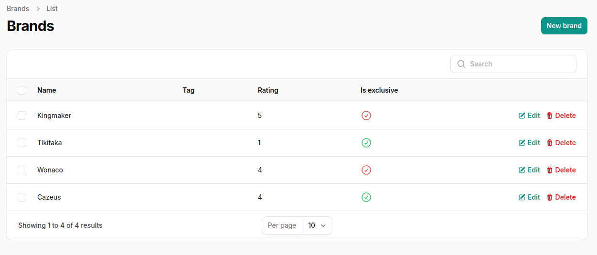

# Brand Back-end

## Clone the application
```bash
git clone https://github.com/cybersoldattech/brands-back-end.git
cd brands-back-end
```

### Instal Php dependency
```bash
    composer install 
```

### The project contains a command to initialize the project 
- [x] Installation of dependencies via composer and npm :tada:
- [x] Creation of the Env file :tada:
- [x] Generation of the key artisan  :tada:
- [x] Publish storage folders :tada:
- [x] Migration of the database :tada:
- [x] create Seed Data :tada:

> [!NOTE] 
> It is possible to modify the env file to make specific needs.


### The API will be accessible at: http://localhost:8000/api . Where 8000 is the application startup port

##### For GET all brands

```bash
      http://localhost:8000/api/brands 
```

##### For POST the brand
```bash
      http://localhost:8000/api/brands 
```

##### For PUT the brand 

```bash
      http://localhost:8000/api/brands/{id} 
```

> [!IMPORTANT] 
> where id represents the brand identifier


##### For DELETE add brands

```bash
      http://localhost:8000/api/brands/{id} 
```

> [!IMPORTANT] 
> where id represents the brand identifier


### Admin interface will be accessible at: http://localhost:8000/admin/login . where 8000 is the application startup port

##### Login Interface


##### Brand list interface




##### Interface to create the brand


##### Interface for modifying the brand


